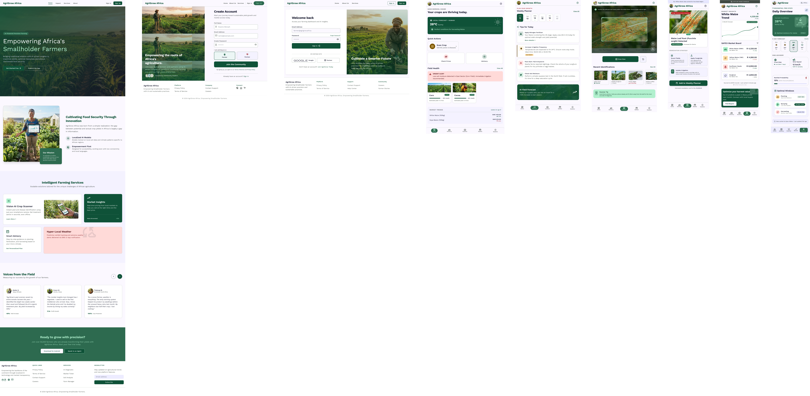

# 🌱 AgriculturalAi

> An AI-powered agricultural management platform built with Angular 21 and Supabase — helping farmers make smarter decisions through data, AI, and community.



---

## 🚀 Features

| Feature | Description |
|---|---|
| 🤖 **AI Assistant** | Conversational AI to answer farming questions in real time |
| 🌾 **Crop Advisor** | Personalized crop recommendations based on location & season |
| 🦠 **Disease Detection** | Upload plant images and detect diseases using AI |
| 📈 **Market Prices** | Live crop market price tracking |
| 🌦️ **Weather** | Hyperlocal weather forecasts for your farm |
| 📅 **Farm Planner** | Schedule and track farming activities |
| 📊 **Analytics** | Yield trends, cost breakdowns, and performance insights |
| 🏪 **Marketplace** | Buy and sell produce directly with other farmers |
| 🌍 **Community** | Connect with fellow farmers, share knowledge |
| 🔔 **Notifications** | Real-time alerts for weather, market shifts, and tasks |
| 🗺️ **My Farm** | Manage your farm profile, fields, and crop history |
| ⚙️ **Settings** | Customise your experience, notifications, and preferences |

---

## 🛠️ Tech Stack

- **Frontend**: [Angular 21](https://angular.dev) with standalone components
- **UI Library**: [Angular Material](https://material.angular.io) + custom SCSS design system
- **Charts**: [Chart.js](https://chartjs.org) via [ng2-charts](https://github.com/valor-software/ng2-charts)
- **Backend**: [Supabase](https://supabase.com) — Auth, PostgreSQL, Edge Functions, Realtime
- **Hosting**: [Netlify](https://netlify.com)

---

## 📁 Project Structure

```
src/
├── app/
│   ├── core/               # Services, guards, interceptors, Supabase client
│   │   ├── services/       # Auth, Farm, Task, Notification, AppState
│   │   ├── guards/         # Route protection (auth.guard)
│   │   └── supabase/       # Supabase client initialisation
│   ├── features/           # Page-level feature components
│   │   ├── landing/
│   │   ├── auth/           # Login, Register, Forgot Password
│   │   ├── dashboard/
│   │   ├── ai-assistant/
│   │   ├── crop-advisor/
│   │   ├── disease-detection/
│   │   ├── market-prices/
│   │   ├── weather/
│   │   ├── planner/
│   │   ├── analytics/
│   │   ├── marketplace/
│   │   ├── community/
│   │   ├── my-farm/
│   │   ├── notifications/
│   │   ├── settings/
│   │   └── admin/
│   ├── layouts/            # Shell layouts (Landing, Dashboard, Auth)
│   └── shared/             # Reusable components, directives, pipes, models
├── styles/                 # Global SCSS design system
│   ├── abstracts/          # Variables, mixins, functions
│   ├── base/               # Reset, typography, globals
│   ├── components/         # Button, card, form, table styles
│   ├── layout/             # Navbar, sidebar, footer styles
│   └── themes/             # Angular Material theme
supabase/
├── functions/              # Edge Functions (disease-scan, market-prices, weather)
└── migrations/             # Database schema migrations
```

---

## ⚡ Getting Started

### Prerequisites

- [Node.js](https://nodejs.org) v18+
- [Angular CLI](https://angular.dev/tools/cli) v21+
- A [Supabase](https://supabase.com) project

### 1. Clone the repository

```bash
git clone https://github.com/Nellark/AgriculturalAi.git
cd AgriculturalAi
```

### 2. Install dependencies

```bash
npm install
```

### 3. Configure environment

Create a `.env` file in the root (already in `.gitignore` for security):

```env
VITE_SUPABASE_URL=your_supabase_project_url
VITE_SUPABASE_ANON_KEY=your_supabase_anon_key
```

Then mirror these into `src/environments/environment.ts`:

```ts
export const environment = {
  production: false,
  supabaseUrl: 'your_supabase_project_url',
  supabaseKey: 'your_supabase_anon_key',
};
```

### 4. Run the database migrations

```bash
supabase db push
```

### 5. Start the development server

```bash
npm start
# or
ng serve
```

Open [http://localhost:4200](http://localhost:4200) in your browser.

---

## 🗄️ Database Migrations

| Migration | Description |
|---|---|
| `001_initial_schema` | Core tables: users, farms, crops, tasks, notifications |
| `002_add_crop_prices` | Market price tracking table |
| `003_seed_crop_prices` | Initial seed data for crop prices |
| `004_fix_search_path_security` | Security hardening for Postgres functions |

---

## ☁️ Supabase Edge Functions

| Function | Endpoint | Description |
|---|---|---|
| `disease-scan` | `/functions/v1/disease-scan` | Analyses plant images for disease detection |
| `market-prices` | `/functions/v1/market-prices` | Fetches live crop market prices |
| `weather` | `/functions/v1/weather` | Returns hyperlocal weather forecasts |

Deploy with:

```bash
supabase functions deploy
```

---

## 🚢 Deployment

This project is configured for **Netlify** deployment via [`netlify.toml`](netlify.toml).

```bash
npm run build
# Output in dist/ — deploy to Netlify or any static host
```

---

## 🌿 Branching Strategy

| Branch | Purpose |
|---|---|
| `main` | Production-ready code |
| `develop` | Active development branch |

All new features should be built on `develop` and merged to `main` via Pull Request.

---

## 🤝 Contributing

1. Fork the repo
2. Create a feature branch: `git checkout -b feature/your-feature`
3. Commit your changes: `git commit -m "feat: add your feature"`
4. Push to your branch: `git push origin feature/your-feature`
5. Open a Pull Request targeting `develop`

---

## 📄 License

This project is private and proprietary to **Nellark**. All rights reserved.
